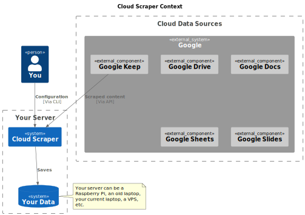

# Cloud Scraper

---
Get your cloud data on your terms.

## What is Cloud Scraper?

Cloud Scraper is an open source tool that allows you to download your data from cloud services on a
regular basis to limit exposure to failure or data loss. It's a command line tool that's easy to
use, and can be used on any platform.

## Why is Cloud Scraper?

I saw a very enlightening post on academic Mastodon, and, though I'm unable to find it now, it
made a very good point. The gist was that we should be wary of cloud services, and we should back up
any data of ours that they hold regularly.

One line that stuck with me was, this lecturer asking her students (with her hand up), "hands up
who has backed up their Google Docs in the last 24 hours?".

I certainly wouldn't do this if I had to remember to do it. I also think that if I had a hackable
pluggable solution to do this automatically, I might start to find some cute new things to do with
the data that I generate.

Crucially, anything I decide to do with my data will be on my hardware and my terms.

The motive to action for me is that I've been using Google Keep more often recently for
journaling & whatnot. I think it's becoming quite useful to me. I also think that Google could pull
the plug on it at any time, and I'd lose all of my data. I don't want that to happen.

### Why is Cloud Scraper written in Rust?

Because this is a personal project and I like Rust.

## What is the current status of Cloud Scraper?

Ideation/solution design - there is no working implementation at the time of writing.

## Architecture

Figure 1 shows the flow of data in the proposed solution. It uses Google as an example, but the same
flow applies to any cloud service.



###### Figure 1 - Cloud Scraper context

### Extensibility

The plan is to introduce modules for each cloud service, data store or data transformation.
These each have configuration controllable by the user.

The modules are to be implemented as nodes that pass events to each other.

I intend to implement Google Docs and Tasks initially because this is the service I think is the
biggest risk for me. By risk, I mean the combination of probability and impact for me of tasks
and documents becoming unavailable.

Originally, I wanted to do this with Keep, but that API is restricted to enterprise users, and
building a scraper that uses headless web pages to pull the information is a large taks for a
first implementation.

## Building

### Dependencies

Probably you already have this dev library installed if you're doing any other development in a
systems programming language. If not, you'll need to install it.

```bash
openssl
```

Beyond that, it's a pretty normal Rust project.

```bash
cargo build # build
cargo test # run tests
```

### Configuration

Cloud Scraper can be configured by a yaml file. You can either use the default `config.yaml` or
specify a file name by command line argument.

```bash
cargo run -- -c my-config.yaml
```

The service only requires a `config.yaml` file if you're going to configure a domain. The minimum
contents are:

```yaml
email: your@email.address
```

But this is only required if you add a domain configuration:

```yaml
domain_config:
  builder_contacts: [ "an@other.email", "your@email.address" ]
  domain_name: your.domain.name
  poll_attempts: 10
  poll_interval_seconds: 10
email: your@email.address
```

If a domain is configured, the service will check for a root certificate, and if a valid one is
not found, it will request one from Let's Encrypt. The poll attempts and poll interval
parameters are used to manage how the service retries attempts to retrieve a certificate.

#### Ports

##### Web Interface

By default, the service listens on port 443. You can change this in the configuration file.

```yaml
port: 1234
```

Or by command line argument.

```bash
cargo run -- -p 1234
```

### Running

First, you should set a root password. There is only one, and no user because this system is
single-tenant by design.

```bash
cargo run root-password
```

You can then run the service.

```bash
cargo run
```

You can get log information by setting the `RUST_LOG` environment variable.

```bash
RUST_LOG=debug cargo run
```

Of course you can also run the binary directly.

```bash
./target/debug/cloud_scraper
```

#### Permission to open ports < 1024 as a non-root user

Linux usually doesn't let you open ports like 80 or 443 as a non-root user. You can use the
following
command to allow this.

```bash
# If needed, install setcap, for example in Ubuntu: sudo apt-get install libcap2-bin
sudo setcap cap_net_bind_service=+ep ./target/debug/cloud_scraper
```

Remember that after running the above that the permission applies to `cloud_scraper`, not
`cargo`. Using `cargo run` will not work with the above permission.
