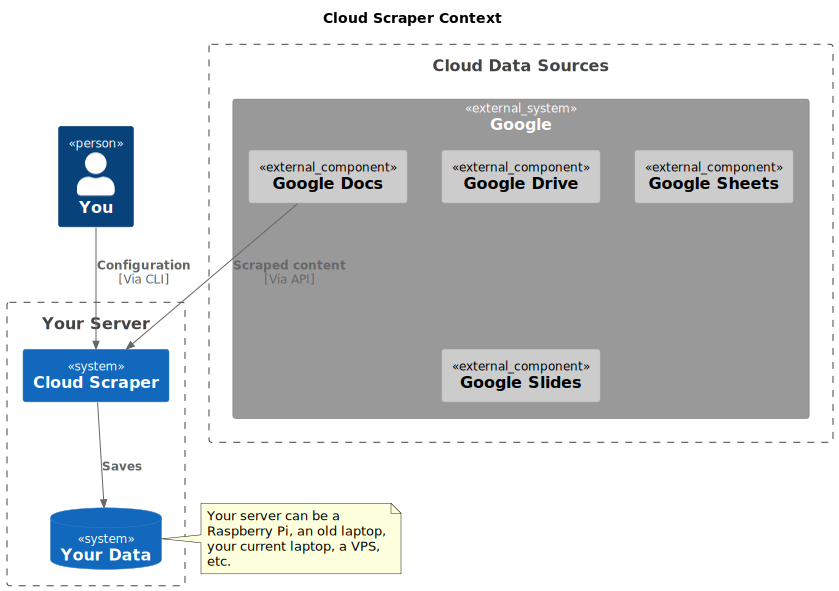

# Cloud Scraper

---
Get your cloud data on your terms.

## What is Cloud Scraper?

Cloud Scraper is an open source tool that allows you to download your data from cloud services on a
regular basis to limit exposure to failure or data loss. It's a command line tool that's easy to
use, and can be used on any platform.

## Why is Cloud Scraper?

I saw a very enlightening post on academic Mastodon, and, though I'm unable to find it now, it
made a very good point. The gist was that we should be wary of cloud services, and we should back up
any data of ours that they hold regularly.

One line that stuck with me was, this lecturer asking her students (with her hand up), "hands up
who has backed up their Google Docs in the last 24 hours?".

I certainly wouldn't do this if I had to remember to do it. I also think that if I had a hackable
pluggable solution to do this automatically, I might start to find some cute new things to do with
the data that I generate.

Crucially, anything I decide to do with my data will be on my hardware and my terms.

The motive to action for me is that I've been using Google Keep more often recently for
journaling & whatnot. I think it's becoming quite useful to me. I also think that Google could pull
the plug on it at any time, and I'd lose all of my data. I don't want that to happen.

### Why is Cloud Scraper written in Rust?

Because this is a personal project and I like Rust.

## What is the current status of Cloud Scraper?

Ideation/solution design - there is no working implementation at the time of writing.

## Architecture

Figure 1 shows the flow of data in the proposed solution. It uses Google as an example, but the same
flow applies to any cloud service.



###### Figure 1 - Cloud Scraper context

### Extensibility

The plan is to introduce pluggable modules for each cloud service, and a pluggable module for each
data store. This will allow the user to choose which cloud service they want to use, and which data
store they want to use.

I intend to implement Google Keep initially because this is the service I think is the biggest risk
for me. By risk, I mean the combination of probability and impact for me of my Keep notes
becoming unavailable.

## Building

### Dependencies

Probably you already have this dev library installed if you're doing any other development in a
systems programming language. If not, you'll need to install it.

```bash
openssl
```

Beyond that, it's a pretty normal Rust project.

```bash
cargo build # build
cargo test # run tests
```

### Running

```bash
cargo run
```

You can get log information by setting the `RUST_LOG` environment variable.

```bash
RUST_LOG=debug cargo run
```

Of course you can also run the binary directly.

```bash
./target/debug/cloud_scraper
```

#### Permission to open ports < 1024 as a non-root user

Linux usually doesn't let you open ports like 80 or 443 as a non-root user. You can use the
following
command to allow this.

```bash
# If needed, install setcap, for example in Ubuntu: sudo apt-get install libcap2-bin
sudo setcap cap_net_bind_service=+ep ./target/debug/cloud_scraper
```

Remember that after running the above that the permission applies to `cloud_scraper`, not
`cargo`. Using `cargo run` will not work with the above permission.
